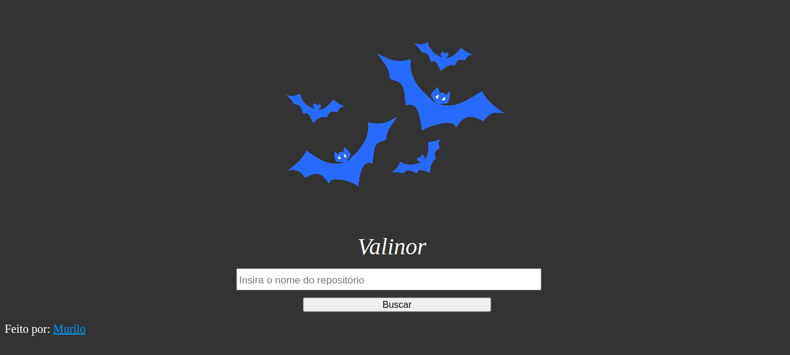

# Desafio Técnico Valinor 🌳

## Desafio técnico da Field Control, consumindo a API do GitHub para consulta de repositórios, com paginação 🐱

## Tecnologias utilizadas 🚀
- HTML5
- CSS3
- JavaScript
- GitHub API REST
  
## Screenshot 📸

## Implementação de segurança na consulta 🔒
Ao realizar consultas com um payload de XSS pude perceber a vulnerabilidade no consumo da API, pois os dados não eram sanitizados adequadamente. 
Pude reparar que ao digitar no campo de pesquisa (input) o payload:
<code> <script>alert("XSS")<script></code>
Eram executados repositórios maliciosos com esse nome, redirecionando para páginas paralelas na própria aplicação!

Para realizar a correção fiz a sanitização dos parâmetros de requisição para nodeValue, onde o navegador não mais interpretaria as entradas como código e sim como texto.

<strong>Código antigo (vulnerável) 👾</strong> 

<code> 
 repoItem.innerHTML = `
             
                <a href=${repo.html_url} style="color:rgb(0, 132, 255)" target="_blank"><strong>${repo.full_name}</strong></a> 
                🌟Stars: ${repo.stargazers_count} | 👀Watchers: ${repo.watchers_count} 
                📋Forks: ${repo.forks_count} | 🚨Issues: ${repo.open_issues_count} 
                💾Descrição: ${repo.description}  
                

            `;
            
            reposList.appendChild(repoItem);
        });
</code>

<strong>Código atualizado (seguro contra XSS) ✔️</strong> 

<code> 
 repoItem.innerHTML = `
             
                //Sanitização de dados antes da interpretação pelo navegador (Evitar XSS)//
                    const SanitizedRepoName = document.createTextNode(repo.full_name);
                    const SanitizedDescription= document.createTextNode(repo.description);
                    const SanitizedStars= document.createTextNode(repo.stargazers_count);
                    const SanitizedWatchers= document.createTextNode(repo.wachers_count);
                    const SanitizedForks= document.createTextNode(repo.forks_count);
                    const SanitizedIssues= document.createTextNode(repo.open_issues_count);
                    const SanitizedUrl=document.createTextNode(repo.html_url);
    
    
    
                repoItem.innerHTML = `
                 
                    <a href=${SanitizedUrl.nodeValue} style="color:rgb(0, 132, 255)" target="_blank"><strong>${SanitizedRepoName.nodeValue}</strong></a> 
                    🌟Stars: ${SanitizedStars.nodeValue} | 👀Watchers: ${SanitizedWatchers.nodeValue} 
                    📋Forks: ${SanitizedForks.nodeValue} | 🚨Issues: ${SanitizedIssues.nodeValue} 
                    💾Descrição: ${SanitizedDescription.nodeValue}  
                    

                `;
                
                reposList.appendChild(repoItem);
            });
</code>
  
